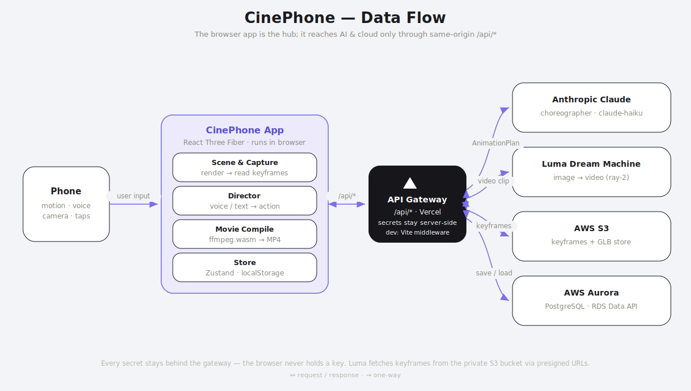

# CinePhone — Phone-Motion 3D Film Studio

CinePhone turns your phone into a handheld film camera for a 3D scene. You
**physically move the phone** to look around a studio, **spawn rigged characters
and props**, **direct them by voice or text** (an LLM choreographs real motion),
record camera moves, and finally **generate a cinematic movie** with Luma AI —
one video clip per scene, stitched into a single MP4 in the browser.

Built with **Vite + React 19 + TypeScript + React Three Fiber** (Three.js).
Phone rotation drives the camera via the DeviceOrientation API (smoothly
damped); a marker-based AR mode adds full 6DoF walk-through; desktop falls back
to mouse OrbitControls so you can develop without a device.

---

## Architecture



Three layers, with **every secret kept server-side**:

- **Client** — the React Three Fiber single-page app. Owns the 3D scene, camera
  control (motion/AR/orbit), voice + director input, a Zustand store persisted to
  `localStorage`, and the movie pipeline (keyframe capture → `ffmpeg.wasm`).
- **Vercel** — production hosting. The **Static Edge/CDN** serves the built SPA
  and bundled GLB models; **Serverless Functions** expose the same-origin
  `/api/*` surface and hold the API keys. In **dev**, the identical `/api/*`
  surface is served by Vite middleware in [`server/`](server/) — so nothing in
  the architecture changes between dev and prod.
- **External services** — **Luma Dream Machine** (image→video), **Anthropic
  Claude** (the choreographer/director), **AWS S3** (keyframes + GLB store), and
  **AWS Aurora Serverless v2** PostgreSQL via the RDS Data API (projects,
  generations, model catalog).

> The browser only ever calls same-origin `/api/*`. Luma/Anthropic/AWS
> credentials live in serverless env vars (or Vite's env in dev) and are never
> bundled. Luma fetches keyframes from private S3 via short-lived presigned URLs.

---

## Quick start

```bash
npm install
npm run dev      # HTTPS dev server on localhost + your LAN IP
```

- **Desktop:** open `https://localhost:5173`, accept the self-signed cert. Drag
  to look around (OrbitControls fallback).
- **Phone (same Wi-Fi):** open the `https://<lan-ip>:5173` URL printed in the
  terminal, accept the cert, tap **Enable Motion**, then move the phone to look
  around the studio.

> Motion sensors require **HTTPS** and, on iOS, an explicit permission tap — both
> handled by `@vitejs/plugin-basic-ssl` and the in-app permission gate. The core
> studio works with **no API keys**; AI direction and movie generation light up
> once you configure the services below.

### Scripts

| Command           | Description                          |
| ----------------- | ------------------------------------ |
| `npm run dev`     | HTTPS dev server (localhost + LAN)   |
| `npm run build`   | Type-check (`tsc -b`) + prod build   |
| `npm run preview` | Preview the production build         |
| `npm run lint`    | Lint with oxlint                     |

---

## What you can do

| Feature | How | Powered by |
| ------- | --- | ---------- |
| **Look around** | Move/rotate the phone | DeviceOrientation API (damped) |
| **Walk through the scene** | Tap **AR**, point at a Hiro marker | AR.js marker 6DoF |
| **Build a set** | Library → Terrain / Objects / Set pieces | procedural terrain + CC0 GLB props |
| **Choose a mood** | Library → Environment | per-scene lighting/fog presets |
| **Cast performers** | Library → Objects → characters | bundled CC0 rigged GLBs |
| **Direct the action** | Speak or type a command | Claude → `AnimationPlan` (keyword fallback offline) |
| **Record a shot** | Camera panel → record / preview | per-frame camera samples |
| **Generate a movie** | Clapperboard → **Generate Movie** | Luma image→video + `ffmpeg.wasm` |
| **Save to the cloud** | Project HUD → Cloud Save / autosave | Aurora via `/api/db/*` |

The right-side **pill rail** (Play/Stop · Library · Camera · AR · Generate) is the
main control surface; the **HUD** (top-left) manages projects and scenes.

---

## The project model — one source of truth

[`src/types/project.ts`](src/types/project.ts) defines the serializable
**`Project`** document that holds everything:

```
Project → Scene → Action → Take
                ↘ Character (performer)
                ↘ objects · terrain · camera recording · fov · environment
```

Each `Scene` owns its own terrain, objects, characters, actions (the script), and
recorded camera move. All edits flow through the **active scene** in the Zustand
store ([`useEditorStore.ts`](src/state/useEditorStore.ts)), which persists to
`localStorage` and (when configured) autosaves to Aurora.

---

## AI & cloud setup

Copy [`.env.example`](.env.example) to `.env` and fill in what you want. Only
`VITE_`-prefixed vars reach the browser; everything else stays server-side.
`GET /api/health` reports which providers are live (`{storage, aurora, luma, llm}`)
and drives the in-app notices.

### LLM director — Claude

```
ANTHROPIC_API_KEY=...      # server-side; enables the choreographer
```

When you direct an action, [`buildContext.ts`](src/choreo/buildContext.ts)
describes the scene and `claude-haiku` returns a validated **`AnimationPlan`** (a
sequence of move/face/play/wait steps) executed on each rig. Without a key, a
keyword fallback still produces a one-step plan, so directing works offline.

### Generate Movie — Luma + AWS

```
LUMA_API_KEY=...           # funded Luma key
VITE_LUMA_MODEL=ray-2      # client-visible render settings
AWS_REGION=us-east-1
AWS_ACCESS_KEY_ID=...
AWS_SECRET_ACCESS_KEY=...
S3_BUCKET=...              # private is fine — keyframes go out as presigned URLs
AURORA_RESOURCE_ARN=...    # Aurora Serverless v2 + Data API enabled
AURORA_SECRET_ARN=...      # Secrets Manager secret with the DB creds
AURORA_DATABASE=...
```

The pipeline ([`useMovieGeneration.ts`](src/generation/useMovieGeneration.ts)):

1. **Capture** — pose the camera to each scene's recorded first/last frame and
   read back pixels as keyframes ([`SceneCapturer`](src/scene/SceneCapturer.tsx)).
2. **Upload** — push keyframes to **S3**; record the render to **Aurora**.
3. **Generate** — [`buildScenePrompt`](src/generation/buildPrompt.ts) turns the
   scene into a cinematic prompt; **Luma** runs image→video per scene.
4. **Compile** — [`compileMovie`](src/generation/compileMovie.ts) concatenates
   the clips into one MP4 with `ffmpeg.wasm`; preview + **Download**.

**AWS minimum IAM:** `s3:PutObject` + `s3:GetObject` on the bucket,
`rds-data:ExecuteStatement` on the cluster, `secretsmanager:GetSecretValue` on
the DB secret. Aurora tables (`cinephone_projects`, `cinephone_generations`,
model catalog) auto-create on first call.

> Each scene is a **paid** Luma generation (~30–60s). `ffmpeg.wasm` (~30MB) is
> lazy-loaded only when compiling. The AWS SDK is imported only by `server/*`, so
> it never enters the browser bundle.

### AR (optional)

```
VITE_ARJS_URL=...          # AR.js runtime (CDN, loaded at runtime)
VITE_AR_MARKER=hiro
VITE_AR_POSE_SCALE=8       # metres → scene units
```

Built behind an SDK-agnostic **`PoseSource`** contract
([`src/types/pose.ts`](src/types/pose.ts)) so the tracking backend is swappable —
AR.js marker tracking is the free, iOS-Safari-capable default. Print the
[Hiro marker](https://raw.githubusercontent.com/AR-js-org/AR.js/master/data/images/hiro.png),
tap **AR**, grant camera access, point at it, and move around. The opaque scene
renders over the feed (the feed is used only for tracking — no passthrough).

---

## Deployment (Vercel)

`server/` is **dev-only** Vite middleware. For production, host the static build
on Vercel and re-expose the identical `/api/*` routes as **serverless functions**
(same handlers, reading the same env vars):

| Route | Purpose | Backend |
| ----- | ------- | ------- |
| `GET /api/health` | which providers are configured | — |
| `POST /api/luma/{generate,status,asset}` | Luma proxy | Luma |
| `POST /api/choreograph` · `/api/direct` | LLM director | Claude |
| `POST /api/storage/upload` · `GET /api/storage/model` | keyframe upload / GLB stream | S3 |
| `GET/PUT /api/db/project` · `GET /api/db/{projects,generations,models}` | persistence | Aurora |

```bash
npm run build        # → dist/  (static SPA + assets)
```

Point Vercel at the build output, port the [`server/`](server/) handlers into
`api/` functions, and set the env vars in the Vercel dashboard. The client needs
**no change** — it already speaks same-origin `/api/*`.

---

## Tech stack

**Frontend** React 19 · TypeScript · Vite 8 · React Three Fiber + drei · Three.js
· Zustand · GSAP · `ffmpeg.wasm` · Web Speech API · DeviceOrientation · AR.js
**Backend (dev middleware / prod serverless)** Node · `@anthropic-ai/sdk` ·
`@aws-sdk` (S3 + RDS Data + presigner)
**Cloud** Luma Dream Machine · Anthropic Claude · AWS S3 · AWS Aurora Serverless v2

---

## Credits

- **Characters** — KayKit Character Packs (Adventurers, Skeletons) by Kay
  Lousberg (**CC0**); three.js **RobotExpressive**; Khronos **Fox** (CC0).
- **Props** — KayKit Dungeon Remastered set pieces (**CC0**).

Characters without a [`config/characters.ts`](src/config/characters.ts) preset
fall back to a procedural blocky avatar. Drop a `.glb` in `public/models/` and add
a preset to extend the cast.
